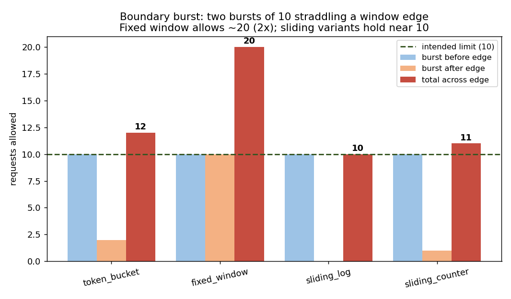

# Rate Limiter Service

A distributed rate-limiting service in Python, backed by Redis. It answers one
question very fast and very correctly: **"is this client allowed to make a
request right now?"** It offers four classic algorithms behind one HTTP API,
and every limit check is a single atomic operation — so it stays correct under
heavy concurrent load and across many API servers.

Built in five phases, each independently runnable and tested.



*The headline result: under two bursts straddling a window edge (limit = 10 per
1s), **fixed window allows 20** — twice the intended limit — while the sliding
variants hold near 10. Visualizing this tradeoff is the point of the project.*

## What it does

- Answers `is client X allowed?` over HTTP, returning `200` or `429 Too Many
  Requests` with the standard `X-RateLimit-Remaining` and `Retry-After` headers.
- Offers four interchangeable algorithms: **token bucket**, **fixed window**,
  **sliding window log**, **sliding window counter** — pick one per request.
- Keeps per-client state in **Redis**, so many API servers enforce one
  consistent limit. Add servers freely.
- Makes every check **atomic** via a Lua script, so concurrent requests can
  never both take the last slot.

## Architecture

```
   caller
     │  POST /check {client_id, limit, window, algorithm}
     ▼
 ┌─────────────┐     picks      ┌──────────────┐    atomic    ┌─────────┐
 │  FastAPI    │ ─────────────▶ │  algorithm   │ ───Lua────▶  │  REDIS  │
 │  (service)  │ ◀───────────── │  (4 options) │ ◀─────────── │ counters│
 └─────────────┘  allowed/429   └──────────────┘   result     └─────────┘
```

The API is stateless; all per-client state lives in Redis. Run many API
servers behind a load balancer — they all enforce one shared limit.

## Phases

| Phase | Adds | Key idea |
|-------|------|----------|
| **1** | in-memory token bucket | the refill-and-take math |
| **2** | Redis + atomic Lua | correct under concurrency (exactly K of N) |
| **3** | four algorithms | the accuracy / memory tradeoff |
| **4** | FastAPI HTTP service | 429s + standard rate-limit headers |
| **5** | benchmark + charts | the boundary-burst comparison |

Each phase has its own README (`README_rl_phase1.md` … `README_rl_phase5.md`)
with the details.

## Quick start

```bash
pip install -r requirements.txt

# free cloud Redis (Upstash / Redis Cloud) — no install needed on a tablet
export REDIS_URL="rediss://default:<password>@<host>.upstash.io:6379"

# run the service
uvicorn service:app --port 8000

# in another terminal/cell:
python demo_client.py
# or:
curl -X POST localhost:8000/check -H 'content-type: application/json' \
     -d '{"client_id":"user-1","limit":5,"window":2,"algorithm":"token_bucket"}'
```

## The four algorithms

| Algorithm | Strength | Cost / flaw | Use when |
|---|---|---|---|
| token bucket | smooth rate + controlled burst | burst can exceed steady rate briefly | you want to allow short bursts |
| fixed window | simplest, tiny memory | 2× boundary burst at window edges | rough limiting, simplicity matters |
| sliding window log | exact, no boundary burst | memory grows per request | exactness matters, modest volume |
| sliding window counter | near-exact, fixed memory | small approximation | the usual production default |

## Run the benchmark

```bash
python benchmark_rl.py
```
Produces `rl_boundary.png` (the boundary-burst comparison, above) and
`rl_acceptance.png` (acceptance under steady overload), plus a JSON of results.

## Tests

Every phase ships tests. Phases 2–4 need a reachable Redis.

```bash
python test_rl_phase1.py   # no Redis needed
python test_rl_phase2.py
python test_rl_phase3.py
python test_rl_phase4.py
```

Highlights:
- **Phase 2** — 50 concurrent requests on a capacity-10 bucket grant exactly 10.
- **Phase 3** — the boundary-burst test: fixed window ~2×, sliding variants hold.
- **Phase 4** — the HTTP service returns correct 200/429 and rate-limit headers.

## Tech stack

- Python · `redis` (async) with atomic Lua scripts
- `FastAPI` + `uvicorn` for the HTTP service
- `matplotlib` for the comparison charts
- Upstash / Redis Cloud — free hosted Redis

## Design decisions worth knowing

- **Atomic Lua** for every check — read-decide-write is one uninterruptible
  step, so the limit is never overshot under concurrency.
- **State in Redis, not the server** — the limit is global across all API
  servers; scale out by adding servers, then shard Redis by client_id hash.
- **429 + standard headers** — `Retry-After` and `X-RateLimit-Remaining` are
  what real APIs (GitHub, Stripe) send, so clients can back off correctly.
- **Fail-open vs fail-closed** — if Redis is unreachable, you choose between
  allowing traffic (availability) or denying it (protection); a real decision
  worth stating.

## A note on origins

This service began as a component inside a [distributed web
crawler](https://github.com/NitishaB4042/distributed-web-crawler) (its Phase 3
politeness layer used a token-bucket limiter). It was extracted into a
standalone service and extended with the other three algorithms, an HTTP API,
and the algorithm-comparison benchmark.

## License

MIT (or your choice).
